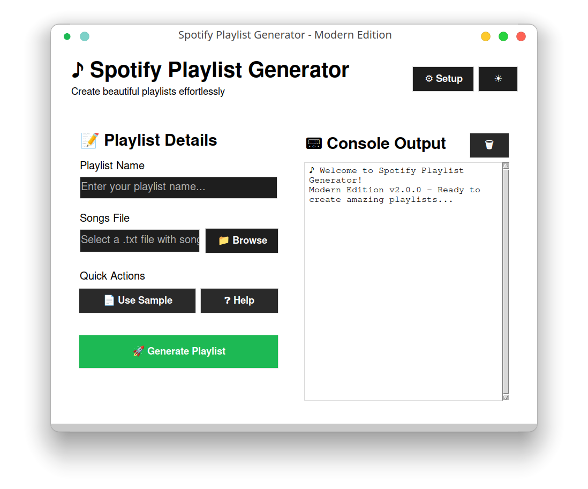
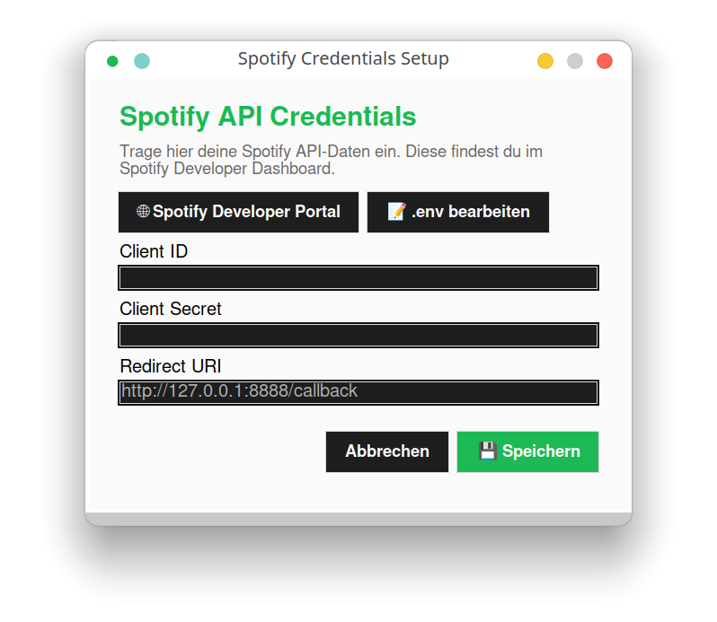

# Spotify Playlist Generator


> A simple tool to create Spotify playlists from a text file of song names.

## 📋 Overview

**Spotify Playlist Generator** allows you to effortlessly generate Spotify playlists from text files. Simply list your favorite tracks in a text file, and this tool handles the rest - finding the songs on Spotify and creating playlists for you, placing them right into your Spotify library.

## ⚙️ Installation

```bash
python3 install.py
```

This will automatically:
- Create a Python virtual environment
- Install required dependencies (spotipy, python-dotenv, etc.)
- Create a template .env file for your Spotify credentials
- Update the script files

## 🔑 Configuration

Before using Spotify Playlist Generator, you need to set up your Spotify Developer credentials:

1. Create a Spotify Developer account at [developer.spotify.com](https://developer.spotify.com/)
2. Create a new application to get your client ID and secret
3. Edit the generated `.env` file with your credentials:
   ```
   SPOTIPY_CLIENT_ID=your_client_id
   SPOTIPY_CLIENT_SECRET=your_client_secret
   SPOTIPY_REDIRECT_URI=http://localhost:8888/callback
   ```

## 🚀 Usage

### GUI Interface (Recommended)

The easiest way to use Spotify Playlist Generator is with the graphical interface:

```bash
python3 gui_runner.py
```

The GUI provides:
- Easy playlist creation without command line knowledge
- Spotify credentials management
- Song file browsing and selection
- Real-time console output
- Automatic environment checking
- One-click opening of created playlists



### Command Line Usage

Create a playlist with:

```bash
./spotylist_create.sh "My Playlist Name" songs.txt
```

Where `songs.txt` contains one song per line in any of these formats:
- Artist - Song Title (e.g., "Kavinsky - Nightcall")
- Spotify Track ID (22-character code)
- Spotify URI (spotify:track:xxxx)
- Spotify URL (open.spotify.com/track/xxxx)

## 📝 Example Playlist Format

```
Timecop1983 – Tonight
FM‑84 feat. Ollie Wride – Running in the Night
The Midnight – Sunset
Magic Sword – In The Face Of Evil
Kavinsky – Nightcall
Dance With The Dead – That House
```

## 🎶 Hint: You can easily use ChatGPT to create your .txt playlist files

Try something like: 
```
 "Hey ChatGPT, Create a Spotify playlist tailored to my taste 
  using the following format: 
    Artist - Song Title
    Artist - Song Title.
    ... "
```

## 🖥️ GUI Features

The GUI includes several helpful features:

- **Splash Screen**: Visual feedback during startup
- **Credentials Management**: Easy setup of your Spotify API keys
- **Console Output**: Formatted, color-coded output makes it easy to follow the process



## ❓ Troubleshooting

- Check your `.env` file has correct credentials
- Make sure your playlist text file has one track per line
- Working with TrackIDs or https, make sure they aren't dead links
- Don't forget to set up your Spotify API-Key - use http://localhost:8888/callback as redirect
- Logs are saved to `spotify_playlist.log` for debugging
- When using the GUI, error messages are displayed in the console output area

## 📄 License

This project is maintained by MxBit © 2025.  
Contact: mxbit(at)yahoo.com
